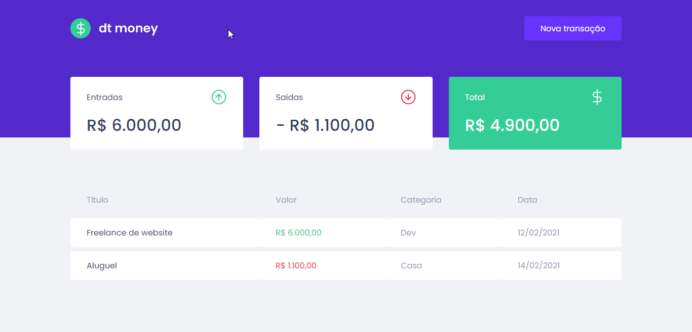

# dt money

<h1 align="center">
    
</h1>

[](./LEIAME.md)

## Summary

* [🧾 About](#-about)
* [🚀 Main technologies](#-main-technologies)
* [🔽 How to download the project](#-how-to-download-the-project)
* [💻 How to run the project](#-how-to-run-the-project)
* [👌 How to use the app](#-how-to-use-the-app)
<br>

## 🧾 About

An application for the personal financial management made with Javascript, Typescript and ReactJS 😃
<br>

## 🚀 Main technologies

* [React](https://reactjs.org/)
* [Typescript](https://www.typescriptlang.org/)
* [Styled Components](https://styled-components.com/)
* [Axios](https://github.com/axios/axios)
* [MirageJS](https://miragejs.com/)

_(You can see all the dependencies in the [package.json](./package.json) file)_
<br>

## 🔽 How to download the project

```bash
$ git clone https://github.com/victorbadaro/dtmoney
```
<br>

## 💻 How to run the project

The commands below use the [yarn](https://yarnpkg.com/) package manager.

```bash
# 1. Install all the project dependencies
$ yarn

# 2. Run the app
$ yarn start

# You can also generate the files to put the app into production with:
$ yarn build

# the files will be available in the dist/ folder
```

If everything runs correctly, a message will be displayed on your terminal informing that the app code has been successfully compiled:

```bash
Compiled successfully
```

After that open your browser and access: http://localhost:3000/

✅ Nice! If you followed all the steps above correctly the project will be running locally on your machine already.
<br>

## 👌 How to use the app

* To register a new transaction, click on the "Nova Transação" button on the top right of the Dashboard page. After registering the transaction, it will be displayed on the transactions table with title, amount (value), category and creation date. Incomes, Outcomes and total values will be changed according with registered transactions:
    

<br>

---
<p align="center">Desenvolvido com ❤ por <a href="https://github.com/victorbadaro">Victor Badaró</a></p>